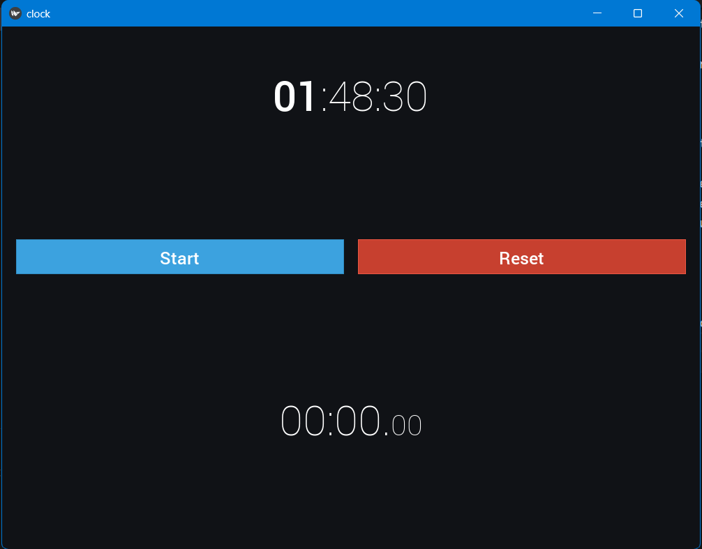

# Application Chronomètre

## Description

Cette application Kivy simple implémente un chronomètre avec une interface utilisateur graphique. Elle affiche l'heure actuelle et permet de démarrer, arrêter et réinitialiser le chronomètre. La mise en forme de l'interface utilise la police de caractères Roboto.

## Comment utiliser

1. Assurez-vous d'avoir Kivy installé en exécutant la commande suivante :
   ```bash
    pip install kivy
   
2. Clonez le dépôt sur votre machine locale.
3. Exécutez `python code.py` dans votre terminal.

## Fonctionnalités

### Chronomètre
L'application comporte un chronomètre qui peut être démarré, arrêté et réinitialisé.

### Affichage de l'Heure Actuelle
L'interface graphique affiche également l'heure actuelle.

### Personnalisation de l'Interface
Vous pouvez personnaliser l'interface en modifiant les fichiers de police ou en ajustant les couleurs selon vos préférences.

### Structure du Code
Le code est divisé en plusieurs parties :

* code.py : Contient la logique principale de l'application.
* clock.kv : Définit la structure de l'interface utilisateur en utilisant le langage de balisage Kivy.

## Exemple



## Contribuer

Les contributions sont les bienvenues ! Si vous souhaitez améliorer Mon Projet Incroyable, veuillez soumettre une pull request. Assurez-vous de consulter notre guide de contribution pour plus d'informations.
